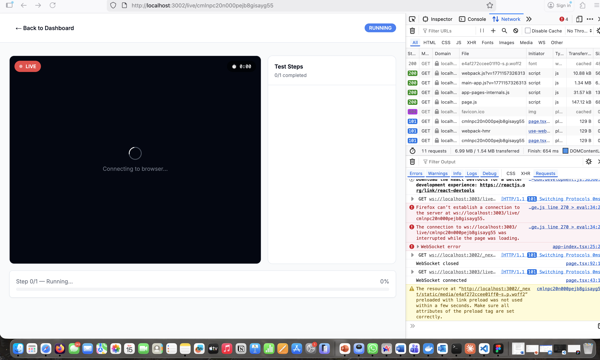

# GovWatch — AI-Powered Black-Box Monitoring Platform



A production-ready MVP platform that continuously monitors Saudi government websites using real browser automation with **live browser streaming**. Watch AI agents browse websites in real-time through CDP Screencast technology.

---

## 🌟 Key Features

### ✅ Implemented & Working

1. **Live Browser Streaming** 🎥
   - Real-time CDP Screencast via WebSocket
   - Watch the browser navigate websites live (~10 fps)
   - Animated cursor showing AI agent interactions
   - Step-by-step progress panel

2. **AI-Powered Testing** 🤖
   - Intelligent element discovery and testing
   - Automatic smoke test generation
   - AI-powered summaries in English & Arabic
   - Supports Claude API, OpenAI API, or template fallback (no API key needed)

3. **Continuous Monitoring** 📊
   - 5 pre-seeded Saudi government websites
   - Automated runs every 10 minutes (configurable)
   - Real-time health status dashboard
   - Incident detection and grouping

4. **Safety-First Architecture** 🛡️
   - Black-box only (no source code access)
   - Same-domain enforcement
   - CAPTCHA/auth detection and avoidance
   - No form submissions or destructive actions
   - Comprehensive console & network logging

5. **Rich Artifacts** 📦
   - Full-page screenshots per step
   - Playwright trace files (.zip)
   - Console logs (errors, warnings, info)
   - Network request/response summaries
   - Performance metrics

---

## 🏗️ Architecture

```
┌─────────────────────────────────────────────────────────┐
│                  Frontend (Next.js 14)                  │
│  Landing Page | Dashboard | Live View | Report          │
└───────────────────┬─────────────────────────────────────┘
                    │
                    ▼
┌─────────────────────────────────────────────────────────┐
│              Backend (Next.js API + WebSocket)          │
│  REST APIs | WebSocket Server :3003 | AI Service        │
└───────────┬──────────────────────────────┬──────────────┘
            │                              │
            ▼                              ▼
┌──────────────────┐          ┌──────────────────────────┐
│  Prisma SQLite   │          │  Playwright + Chromium   │
│  (dev.db)        │          │  CDP Screencast          │
└──────────────────┘          └──────────────────────────┘

┌─────────────────────────────────────────────────────────┐
│              Worker (node-cron scheduler)               │
│  Runs tests every N minutes for active sites            │
└─────────────────────────────────────────────────────────┘
```

---

## 📋 Prerequisites

- **Node.js** 18+ (20 recommended)
- **npm** 9+
- **SQLite** (included with Node.js)
- **(Optional)** Anthropic API key for Claude AI
- **(Optional)** OpenAI API key for GPT-4

---

## 🚀 Quick Start

### Option 1: Automated Setup (Recommended)

```bash
# Clone the repository (or navigate to the project)
cd Rassd-POC

# Run the all-in-one startup script
./start-dev.sh
```

This script will:
1. Install all dependencies if needed
2. Set up the database and seed initial data
3. Install Playwright Chromium browser
4. Start the WebSocket server (ws://localhost:3003)
5. Start the Next.js dev server (http://localhost:3000)

### Option 2: Manual Setup

```bash
# 1. Install dependencies
npm install

# 2. Set up database
npx prisma generate
npx prisma db push

# 3. Seed government websites
npm run seed

# 4. Install Playwright browser
npx playwright install chromium

# 5. Start the worker (WebSocket server + scheduler) - Terminal 1
npm run worker

# 6. Start Next.js dev server - Terminal 2
npm run dev
```

---

## 🌐 Access the Application

Once running, open your browser to:

- **Landing Page**: http://localhost:3000
- **Dashboard**: http://localhost:3000/dashboard
- **WebSocket Server**: ws://localhost:3003

---

## 📖 Usage Guide

### 1. Quick Website Test (URL → Instant Test)

1. Go to the **Landing Page** (http://localhost:3000)
2. Enter any government website URL (e.g., `https://www.absher.sa`)
3. Click **"Start Test"**
4. Watch the **Live Browser View** as the AI agent browses the site
5. View the full **Test Report** with:
   - AI-generated summary (English + Arabic)
   - Step-by-step timeline with screenshots
   - Console logs and network activity
   - Downloadable artifacts (trace, screenshots, logs)

### 2. Dashboard Monitoring

1. Go to **Dashboard** (http://localhost:3000/dashboard)
2. View all monitored sites with:
   - 🟢 **Healthy** | 🟡 **Degraded** | 🔴 **Down** | ⚪ **Unknown**
   - Success rate (24h and 7d)
   - Average response time
   - Open incidents count
3. Click any site card to view detailed metrics and run history
4. Click **"Watch Live"** to see an active test in real-time

### 3. Automated Monitoring

The worker scheduler runs in the background and:
- Checks every minute which sites need testing
- Executes tests based on each site's schedule (default: 10 minutes)
- Groups consecutive failures into **incidents**
- Updates site health status automatically

---

## 🎬 Live Browser Streaming

### How It Works

1. **Playwright** launches Chromium browser
2. **CDP (Chrome DevTools Protocol)** Screencast captures JPEG frames (~10 fps)
3. **WebSocket Server** (port 3003) relays frames to connected clients
4. **React UI** displays frames in real-time with:
   - Live badge indicator
   - Elapsed timer
   - Step-by-step progress
   - Animated cursor overlay

### WebSocket Message Types

```typescript
// Browser frame (JPEG base64)
{ type: "browser-frame", image: "data:image/jpeg;base64,..." }

// Step progress update
{ type: "step-update", step: { index, action, description, status, durationMs, error } }

// Overall run status
{ type: "run-status", status: "running" | "passed" | "failed" }

// Run completion
{ type: "run-complete", status: "passed" | "failed", summary: { ... } }

// Cursor movement (for animated overlay)
{ type: "cursor_move", data: { x, y, elementText, elementType } }

// Cursor click animation
{ type: "cursor_click" }
```

---

## 🔧 Configuration

### Environment Variables (.env)

```env
# Database
DATABASE_URL="file:./dev.db"

# AI Provider (optional — system works without these)
ANTHROPIC_API_KEY="sk-ant-..."        # Claude Sonnet 4
# OPENAI_API_KEY="sk-..."             # GPT-4o-mini

# WebSocket Server
NEXT_PUBLIC_WS_URL="ws://localhost:3003"
WORKER_PORT=3003

# AI Execution Mode
# "plan" = AI generates test plan upfront (1 API call, faster)
# "mcp" = AI makes iterative decisions (N API calls, more flexible)
AI_EXECUTION_MODE="mcp"
```

### Site Monitoring Schedules

Edit site schedules via API or directly in the database:

```sql
-- Set Absher to run every 5 minutes
UPDATE Site SET schedule = 5 WHERE name = 'Absher';

-- Disable monitoring for a site (manual only)
UPDATE Site SET schedule = 0, isActive = false WHERE name = 'Qiwa';
```

---

## 📁 Project Structure

```
Rassd-POC/
├── src/
│   ├── app/                      # Next.js App Router
│   │   ├── page.tsx              # Landing page
│   │   ├── dashboard/            # Monitoring dashboard
│   │   ├── live/[runId]/         # Live browser view page
│   │   ├── report/[runId]/       # Test report page
│   │   └── api/                  # REST API routes
│   │       ├── test/             # Quick test endpoint
│   │       ├── sites/            # Site CRUD
│   │       ├── runs/             # Run execution & details
│   │       ├── incidents/        # Incident management
│   │       └── artifacts/        # Artifact serving
│   │
│   ├── components/
│   │   ├── ui/                   # shadcn/ui components
│   │   ├── live/                 # Live view components
│   │   │   ├── LiveView.tsx      # Main live streaming UI
│   │   │   └── AnimatedCursor.tsx
│   │   ├── dashboard/            # Dashboard components
│   │   └── report/               # Report components
│   │
│   ├── lib/
│   │   ├── executor.ts           # Playwright executor (CDP Screencast)
│   │   ├── ws-server.ts          # WebSocket server
│   │   ├── ai-executor.ts        # AI-powered test execution
│   │   ├── ai-executor-mcp.ts    # MCP-based AI agent
│   │   ├── ai-agent.ts           # AI test planning
│   │   ├── element-discovery.ts  # Smart element finding
│   │   ├── element-tester.ts     # Element interaction testing
│   │   ├── page-analyzer.ts      # Cheerio-based HTML analysis
│   │   ├── incidents.ts          # Incident grouping logic
│   │   ├── ai-summary.ts         # AI summary generation
│   │   ├── ai.ts                 # AI provider abstraction
│   │   ├── validators.ts         # Zod schemas
│   │   └── prisma.ts             # Prisma client
│   │
│   └── worker/
│       └── scheduler.ts          # node-cron scheduler + WS init
│
├── prisma/
│   ├── schema.prisma             # Database schema
│   ├── seed.ts                   # Seed data (5 government sites)
│   └── dev.db                    # SQLite database
│
├── artifacts/                    # Test artifacts (screenshots, traces, logs)
│   └── {siteId}/
│       └── {runId}/
│           ├── step-*.png
│           ├── trace.zip
│           ├── console.json
│           └── network.json
│
├── start-dev.sh                  # All-in-one startup script
├── package.json
├── .env                          # Environment configuration
└── README_COMPLETE.md            # This file
```

---

## 🧪 Testing the System

### Test the Quick Test Flow

1. Start the application: `./start-dev.sh`
2. Open http://localhost:3000
3. Enter URL: `https://www.moh.gov.sa`
4. Click **"Start Test"**
5. Watch the live browser stream
6. Wait for completion (auto-redirects to report)
7. Verify:
   - AI summary is generated
   - Screenshots are captured
   - Console logs are available
   - Network activity is logged

### Test the Dashboard

1. Go to http://localhost:3000/dashboard
2. Verify all 5 seeded sites are visible
3. Check site status badges
4. Click a site card to view details
5. Verify run history table loads
6. Click **"Run Now"** to trigger a manual test
7. Click **"Watch Live"** to see the test stream

### Test the Worker Scheduler

1. Ensure worker is running: `npm run worker`
2. Check console logs for:
   ```
   🚀 GovWatch Worker started
   📡 WebSocket server running on ws://localhost:3003
   ⏰ Scheduler running (checks every minute)
   ```
3. Wait for scheduled runs to execute (every 10 minutes by default)
4. Check dashboard to see updated status

---

## 🛠️ NPM Scripts

| Script | Description |
|--------|-------------|
| `npm run dev` | Start Next.js dev server (port 3000) |
| `npm run worker` | Start worker scheduler + WebSocket server (port 3003) |
| `npm run seed` | Seed database with 5 government sites |
| `npm run db:push` | Push Prisma schema to database |
| `npm run db:studio` | Open Prisma Studio (DB GUI) |
| `npm run setup` | Generate Prisma client + install Playwright |
| `npm run build` | Build for production |
| `npm start` | Start production server |

---

## 🚨 Safety & Compliance

### What GovWatch Does

✅ **Opens websites in a real browser (Chromium)**
✅ **Captures screenshots and console logs**
✅ **Records network requests (URLs, status codes, timings)**
✅ **Tests interactive elements (buttons, links, forms)**
✅ **Streams browser frames via WebSocket**

### What GovWatch Never Does

❌ **NO CAPTCHA bypass or MFA/Nafath/OTP circumvention**
❌ **NO form submissions (read-only testing)**
❌ **NO navigation outside target domain**
❌ **NO arbitrary JavaScript execution**
❌ **NO file downloads from target sites**
❌ **NO credential storage or sensitive data collection**
❌ **NO destructive actions (delete, remove, payments)**

### Domain Safety

Every navigation is checked:

```typescript
function isSameDomain(baseUrl: string, targetUrl: string): boolean {
  const base = new URL(baseUrl);
  const target = new URL(targetUrl);
  return target.hostname === base.hostname ||
         target.hostname.endsWith('.' + base.hostname);
}
```

---

## 🐛 Troubleshooting

### WebSocket Connection Failed

**Problem**: Live view shows "Connecting to browser..." forever

**Solution**:
```bash
# 1. Check if worker is running
ps aux | grep scheduler

# 2. Verify WebSocket server port
lsof -i :3003

# 3. Restart worker
pkill -f scheduler
npm run worker
```

### Playwright Browser Not Found

**Problem**: `browserType.launch: Executable doesn't exist`

**Solution**:
```bash
npx playwright install chromium
```

### Database Locked Error

**Problem**: `SQLITE_BUSY: database is locked`

**Solution**:
```bash
# Stop all processes
pkill -f "next dev"
pkill -f scheduler

# Restart
./start-dev.sh
```

### No AI Summaries Generated

**Problem**: Reports show template summaries instead of AI summaries

**Check**:
1. Verify API key in `.env`: `ANTHROPIC_API_KEY` or `OPENAI_API_KEY`
2. Check AI provider logs in console
3. Ensure API key has sufficient credits

**Note**: System works perfectly without AI keys — uses template summaries instead.

---

## 📊 Database Schema

### Core Models

- **Site**: Government websites being monitored
- **Journey**: Test scenarios for each site
- **Run**: Individual test executions
- **RunStep**: Steps within a run
- **ElementTestResult**: Individual element interaction results
- **Artifact**: Generated files (screenshots, traces, logs)
- **Incident**: Grouped failures with severity tracking

### Key Relationships

```
Site (1) ─── (N) Journey ─── (N) Run ─── (N) RunStep
  │                             │
  └─── (N) Incident             └─── (N) ElementTestResult
                                └─── (N) Artifact
```

---

## 🔮 Future Enhancements

### Planned Features

- [ ] **Multi-browser support** (Firefox, WebKit)
- [ ] **Screenshot diffing** (visual regression detection)
- [ ] **Slack/Teams notifications** for incidents
- [ ] **Custom journey editor** (no-code test builder)
- [ ] **Performance budgets** (lighthouse metrics)
- [ ] **Accessibility checks** (WCAG compliance)
- [ ] **API health monitoring** (JSON endpoint testing)
- [ ] **Multi-region testing** (deploy workers globally)

---

## 📝 API Documentation

### Quick Test

```bash
POST /api/test
Content-Type: application/json

{
  "url": "https://www.absher.sa"
}

# Response
{
  "runId": "clx...",
  "status": "queued",
  "message": "Test started. Watch live at /live/{runId}"
}
```

### List Sites

```bash
GET /api/sites

# Response
{
  "sites": [
    {
      "id": "clx...",
      "name": "Absher",
      "nameAr": "أبشر",
      "baseUrl": "https://www.absher.sa",
      "status": "healthy",
      "schedule": 10,
      "lastRunAt": "2024-02-15T12:30:00Z"
    }
  ]
}
```

### Trigger Manual Run

```bash
POST /api/sites/{siteId}/runs

# Response
{
  "runId": "clx...",
  "status": "queued"
}
```

### Get Run Details

```bash
GET /api/sites/{siteId}/runs/{runId}

# Response
{
  "id": "clx...",
  "status": "passed",
  "durationMs": 12340,
  "summaryJson": { ... },
  "steps": [ ... ],
  "artifacts": [ ... ]
}
```

---

## 🙏 Credits

**Built with:**

- [Next.js 14](https://nextjs.org/) — React framework
- [Playwright](https://playwright.dev/) — Browser automation
- [Prisma](https://www.prisma.io/) — Database ORM
- [shadcn/ui](https://ui.shadcn.com/) — UI components
- [TailwindCSS](https://tailwindcss.com/) — Styling
- [Anthropic Claude](https://www.anthropic.com/) — AI analysis
- [WebSocket (ws)](https://github.com/websockets/ws) — Real-time streaming
- [node-cron](https://github.com/node-cron/node-cron) — Scheduling

---

## 📄 License

MIT License — See LICENSE file for details

---

## 🤝 Contributing

This is an MVP proof-of-concept. For production use:

1. Add authentication & authorization
2. Switch to PostgreSQL for production
3. Implement rate limiting
4. Add proper logging & monitoring (e.g., Sentry)
5. Set up CI/CD pipeline
6. Deploy to cloud (Vercel, AWS, Azure)

---

## 📧 Support

For issues, questions, or feature requests:

1. Check the [Troubleshooting](#-troubleshooting) section
2. Review the [CLAUDE.md](CLAUDE.md) specification
3. Open an issue in the repository

---

**Made with ❤️ for the Saudi digital government ecosystem**

